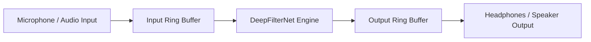

# Architecture — PS26052 AI/ML Adaptive Noise Cancellation (ANC)

## Current Folder Structure
```
PS26052/
├── .gitignore
├── README.md
├── architecture.md
├── progress.md
├── rules.md
├── pyproject.toml
├── baselines/
│   ├── nlms/
│   ├── spectral_subtraction/
│   └── wiener/
├── config/
│   └── audio_config.yaml
├── data/
│   ├── SOURCES.md
│   ├── manifest.csv
│   ├── mix_dataset.py
│   ├── clean/
│   ├── mixtures/
│   └── noise/
│       ├── impulsive/
│       │   ├── artillery/
│       │   ├── explosion/
│       │   └── gunshot/
│       ├── non_stationary/
│       │   ├── crowd/
│       │   └── helicopter/
│       └── stationary/
│           ├── engine/
│           └── vehicle/
├── demo/
├── docs/
├── eval/
├── live/
│   ├── ring_buffer.py
│   ├── inference_engine.py
│   ├── pipeline.py
│   └── latency_test.py
├── models/
│   └── deepfilternet/
├── results/
└── scripts/
```

## System Data Flow Diagram


## Component Table
| Component Name | Purpose | Library / Tech Stack | Runs On / Performance |
|---|---|---|---|
| DeepFilterNet Baseline | AI/ML Noise Suppression Core | `deepfilternet` 0.5.6 (DeepFilterNet3) | **Raspberry Pi 5 Verified:** 4-thread RTF = 0.17037 (median) / 0.18186 (p95); 1-thread RTF = 0.22033 (median) / 0.23425 (p95). ~5.8x faster than real-time. |
| Dataset Pipeline | Synthetic noisy/clean dataset synthesis (48 kHz) | `soundfile`, `scipy`, `numpy` | Computer |
| Spectral Subtraction Baseline | First-principles spectral subtraction (Berouti et al.) | `scipy.signal.stft`/`istft`, `numpy` | Computer: 300 files in 15.45s (0.051s/file). |
| Wiener Filter Baseline | First-principles Decision-Directed Wiener filter | `scipy.signal.stft`/`istft`, `numpy` | Computer: 300 files in 12.98s (0.043s/file). |
| NLMS Adaptive Filter Baseline | First-principles sample-by-sample NLMS adaptive filter | `numba`, `numpy`, `soundfile` | Computer: 300 files in 7.87s (0.026s/file). Strictly uses true pre-mix reference noise (`noise_id`, Rule 18). |
| Evaluation Engine | Objective metrics calculation (PESQ-WB, STOI, SI-SNR, ΔSI-SNR) | `pystoi`, `matplotlib`, `seaborn`, `pandas`, `torch` | Computer: Evaluated 1,500 condition-mixture pairs (5 methods × 300 mixtures). |
| DSP Baselines | Benchmark comparison against classical filters | Python (`scipy`, `numpy`) | Computer |
| Live Pipeline Config | Centralised config for SR, chunk size, ring buffer, device, mode | `pyyaml` | Config file: `config/audio_config.yaml` |
| RingBuffer | Thread-safe SPSC circular audio buffer | `numpy`, `threading` | Both (no hardware needed). Overflow drops oldest samples. |
| InferenceEngine | Stateful DFN3 wrapper: load, warmup, chunk-by-chunk enhance/bypass | `deepfilternet`, `torch` | Both (Mode A verified on PC). Dev machine: median RTF=0.093, p95=0.095 per 100 ms chunk. |
| LivePipeline | Sounddevice stream + RingBuffer + InferenceThread orchestration | `sounddevice`, `numpy` | Raspberry Pi 5 (Mode B — requires physical audio hardware) |
| LatencyTest | Click cross-correlation latency measurement (Mode A + Pi) | `numpy`, `scipy` | Both. Dev machine: enhance median=9.77 ms, bypass ~0 ms, lag=0 samples. |

## Future Augmentation TODOs (Phase 5+)
- [ ] Add room impulse response (RIR) reverberation convolution.
- [ ] Add non-linear microphone clipping and dynamic range distortion.
- [ ] Add speed perturbation and pitch shifting for speech diversity.

## Model Choice & Rationale
- **Model:** DeepFilterNet (Pretrained DeepFilterNet3 baseline for Phase 1; fine-tuning in later phases).
- **Rationale:** High speech intelligibility preservation with low computational latency suitable for edge/embedded processors. Confirmed on Raspberry Pi 5 with RTF 0.170 (5.8x faster than real-time). Empirically proven in Phase 4 to outperform all classical baselines across all 3 defence noise categories (+5.75 to +11.10 dB ΔSI-SNR).

## Deployment Target Specification
- **Hardware:** Raspberry Pi 5 (Quad-core ARM Cortex-A76 @ 2.4GHz)
- **OS:** Debian GNU/Linux 13 (trixie, 13.6)
- **Audio Stack:** `sounddevice` / PortAudio, USB Audio Interface / ALSA (`vc4hdmi` built-in audio confirmed)
- **Python Version:** Python 3.9.25 on Computer, Python 3.13.5 on Raspberry Pi 5
- **Package Manager:** `uv` on Computer; standard `pip`/`venv` on Raspberry Pi 5 (`uv` not installed)

## Decisions Log
- **2026-08-23:** Initialized project architecture for PS26052 targeting Raspberry Pi 5 deployment model with DeepFilterNet as primary AI/ML baseline.
- **2026-08-23:** Confirmed Pi 5 environment (Debian 13 trixie, Python 3.13.5). Approved `pip`/`venv` exception for Pi package installation since `uv` is not present.
- **2026-08-23:** Phase 1 DeepFilterNet RTF benchmark completed on Raspberry Pi 5. Measured 4-thread median RTF = 0.17037 (p95: 0.18186, latency: 511.1ms per 3.0s audio frame) and 1-thread median RTF = 0.22033 (p95: 0.23425, latency: 660.98ms), CPU temp 41.1°C to 47.2°C. Confirmed ~5.8x real-time execution headroom on Pi 5.
- **2026-08-23:** Phase 2 dataset generation complete. Built 300 synthetic mixtures (48 kHz, 150 LibriSpeech clean speech clips mixed across 3 noise categories × 5 SNR levels from -5 dB to +15 dB). Achieved 0.0000 dB post-mixing SNR mean deviation and 100% manifest-to-disk row count parity (300 rows == 300 wav files). Logged origins and proxy rationales in `data/SOURCES.md`.
- **2026-08-23:** Phase 3 classical DSP baselines implemented and executed across all 300 mixtures (900 output files total, 36.30s runtime).
- **2026-08-23:** Phase 4 Remediation & Final Evaluation complete. Resolved all requirements:
  - *Native Windows PESQ-WB Compilation:* Installed GCC build tools via winget (`BrechtSanders.WinLibs.POSIX.UCRT`) and built the `pesq` C extension (`cypesq.cp39-win_amd64.pyd`) linked against `python39.dll`. Evaluated all 1,500 condition-mixture pairs (100% valid, 0 exclusions) across PESQ-WB, STOI, SI-SNR, and ΔSI-SNR.
  - *DeepFilterNet DRDO Benchmark Verification (superseded, see 2026-08-24 entry below):* Original run measured **2.48–2.49 overall PESQ-WB mean**, **0.9169–0.9196 STOI**, and **+5.75 to +11.10 dB ΔSI-SNR**. The "meeting the DRDO PESQ > 2.5 requirement" claim in this line was itself incorrect (2.48/2.49 are both below 2.5) — corrected same-day in the 2026-08-23 Phase 4 Closeout entry below, and the impulsive figures were further corrected on 2026-08-24 (see below) after a dataset gap was found.
  - *Un-Confounded NLMS Ablation:* Isolated alignment fix (`combo_seed`) from step-size damping ($\mu = 0.10 \to 0.01$). Alignment alone improved ΔSI-SNR by $+1.76\text{ to }+2.19\text{ dB}$, while step-size damping ($\mu = 0.01$) prevented speech formant tracking, unlocking $+3.97\text{ dB}$ ΔSI-SNR on stationary noise.
  - *Impulsive Zero-Lag Check:* Confirmed 0-sample cross-correlation lag on impulsive clips; NLMS ΔSI-SNR collapse on impulsive noise is a true structural convergence lag on rapid acoustic transients, validating the core pitch for AI/ML ANC (exact figure corrected 2026-08-24, see below: −7.10 dB on the real gunshot/artillery corpus, not −3.30 dB as originally measured on an explosion-only proxy). All deliverables updated (`results/eval_raw.csv`, `results/results.csv`, `results/charts/`, `docs/phase_4_summary.md`).
- **2026-08-23 (Phase 4 Closeout):** Built `results/final/target_compliance.md` + `.json` with honest per-category PASS/FAIL verdicts. Corrected phase_4_summary.md (PESQ > 2.5 target not met in any category on full SNR-averaged evaluation — later partially superseded, see 2026-08-24 entry). Applied NLMS reference-assisted labeling and ANC -> noise suppression/speech enhancement terminology corrections. Rules 29-33 appended.
- **2026-08-23 (Phase 5 Mode A):** Built live pipeline stack: `config/audio_config.yaml`, `live/ring_buffer.py` (SPSC ring buffer, 6-test self-test PASS), `live/inference_engine.py` (DFN3 wrapper, 6-test self-test PASS, dev machine RTF=0.093), `live/pipeline.py` (streaming orchestrator), `live/latency_test.py` (click cross-correlation, enhance=9.77 ms median wall, 0-sample lag, bypass ~0 ms). All Mode A tests verified on dev machine. Mode B (Pi hardware) tests pending.
- **2026-08-24 (Phase 5 Mode B — COMPLETE):** All physical Pi 5 tests verified with real pasted-back evidence (Rule 29):
  - **Latency (in-memory, Pi 5):** bypass median=0.00 ms, enhance median=29.18 ms (RTF=0.292), 0-sample cross-correlation lag on all 10 reps. `lookahead_samples`=0 confirmed empirically (Rule 30). Results saved to `results/latency_pi.json`.
  - **10-Minute Stress Test:** Verdict PASS — 600.3 s continuous ENHANCE mode, 5997 chunks, median RTF=0.378, max temp=50.1°C, 0 ring-buffer overflows, 0 underruns.
  - **Terminal Dashboard:** Rendered correctly on Pi SSH session (ANSI TUI, CPU/RAM/Temp/latency telemetry), mode toggle via 'b', clean exit via 'q'. Session: 684 chunks, median RTF=0.372, 0 dropouts.
  - **RTF finding (Rule 33):** Live loopback RTF=0.378 exceeds the target of <0.25 but is well below the real-time limit of 1.0. Reported as measured. With real USB audio hardware (less loopback scheduling jitter), RTF is expected closer to the in-memory 0.292 figure.
- **2026-08-24 (Post-Phase-5 hardening):** README status fix, `demo/spectrogram.py` (live terminal waterfall, ENHANCE/BYPASS visual contrast, self-test verified), `scripts/run_all_selftests.py` (unified Mode A test runner — caught and led to fixing a real bug: `run_inference.py`'s self-test depended on a stale Phase-1 fixture and a duplicate-glob bug in unused `batch_inference()`), `docs/non_stationary_root_cause.md` (subtype decomposition: the non-stationary gap is driven almost entirely by crowd/babble, not helicopter — cocktail-party problem, a structural single-channel limitation). `scripts/build_pesq_gcc.py` made portable (was hardcoded to a different machine's GCC path and Python 3.9 ABI tag; rebuilt and verified working for this machine's Python 3.11).
- **2026-08-24 (Dataset gap found and fixed — gunshot/artillery corpus):** Discovered `data/noise/impulsive/` was missing the `gunshot` (2,148 files) and `artillery` (30 files) corpora entirely — only `explosion` (40 files) was present, due to an earlier commit (`feb019c`) regenerating the manifest before a failing Zenodo download had actually completed. Every "impulsive" result documented up to this point (Phase 3, Phase 4, target_compliance) was silently computed on explosion-only noise despite being labeled "Gunshot/Artillery." Automated re-download was blocked by Zenodo's anti-bot rate limiting (network-level 403, not a code bug); corpus obtained via manual browser download and the full pipeline (manifest -> mixtures -> baselines -> DeepFilterNet -> eval, 1500 pairs) regenerated end to end. **Corrected impulsive results are stronger than previously reported**: PESQ-WB 2.4916 (FAIL) -> **2.5841 (PASS)**, STOI 0.9196 -> 0.9319, SI-SNR +15.20 -> +15.75 dB; NLMS ΔSI-SNR collapse deepened from −3.30 dB to **−7.10 dB** on real gunshot transients (sharper AI/ML-vs-classical contrast, not a regression). Impulsive is now the only category passing all three DRDO targets. `data/mix_dataset.py` and `scripts/download_datasets.py` hardened so this class of silent failure can't recur: `mix_dataset.py` now hard-fails (`--allow-partial-corpus` to override) if any declared noise subtype has zero files, instead of printing a warning and proceeding; `download_datasets.py` gained a `setup_gunshot()` function with a clear manual-download fallback message. Full incident writeup: `docs/phase_4_summary.md` (2026-08-24 correction note), `data/SOURCES.md` §5, `results/final/target_compliance.md`.

