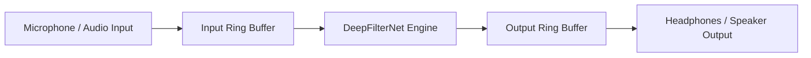

# Architecture — PS26052 AI/ML Adaptive Noise Cancellation (ANC)

## Current Folder Structure
```
PS26052/
├── .gitignore
├── README.md
├── architecture.md
├── progress.md
├── rules.md
├── baselines/
│   ├── nlms/
│   ├── spectral_subtraction/
│   └── wiener/
├── data/
│   ├── clean/
│   ├── mixtures/
│   └── noise/
├── demo/
├── docs/
├── eval/
├── live/
├── models/
│   └── deepfilternet/
└── results/
```

## System Data Flow Diagram


## Component Table
| Component Name | Purpose | Library / Tech Stack | Runs On |
|---|---|---|---|
| DeepFilterNet Baseline | AI/ML Noise Suppression Core | `deepfilternet` (PyTorch core) | Computer & Raspberry Pi 5 |
| Evaluation Engine | Objective metrics calculation (PESQ, STOI, SI-SNR) | `pesq`, `pystoi`, `torchmetrics` | Computer |
| DSP Baselines | Benchmark comparison against classical filters | Python (`scipy`, `numpy`) | Computer |
| Live Pipeline | Real-time audio stream processing | `sounddevice`, `numpy` | Raspberry Pi 5 |

## Model Choice & Rationale
- **Model:** DeepFilterNet (Pretrained baseline for Phase 1; fine-tuned in later phases).
- **Rationale:** High speech intelligibility preservation with low computational latency suitable for edge/embedded processors (Raspberry Pi 5). Supports multi-stage filtering (spectral envelope + deep filtering on complex ERB bands).

## Deployment Target Specification
- **Hardware:** Raspberry Pi 5 (Quad-core ARM Cortex-A76 @ 2.4GHz)
- **OS:** Debian GNU/Linux 13 (trixie, 13.6)
- **Audio Stack:** `sounddevice` / PortAudio, USB Audio Interface / ALSA (`vc4hdmi` built-in audio confirmed)
- **Python Version:** Python 3.12.13 on Computer, Python 3.13.5 on Raspberry Pi 5
- **Package Manager:** `uv` on Computer; standard `pip`/`venv` on Raspberry Pi 5 (`uv` not installed)

## Decisions Log
- **2026-08-23:** Initialized project architecture for PS26052 targeting Raspberry Pi 5 deployment model with DeepFilterNet as primary AI/ML baseline.
- **2026-08-23:** Confirmed Pi 5 environment (Debian 13 trixie, Python 3.13.5). Approved `pip`/`venv` exception for Pi package installation since `uv` is not present.
